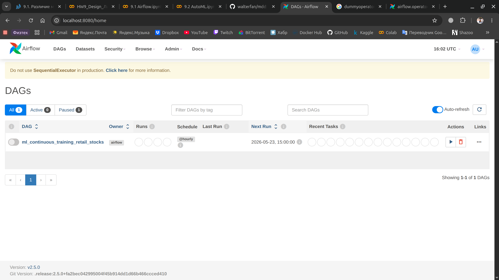
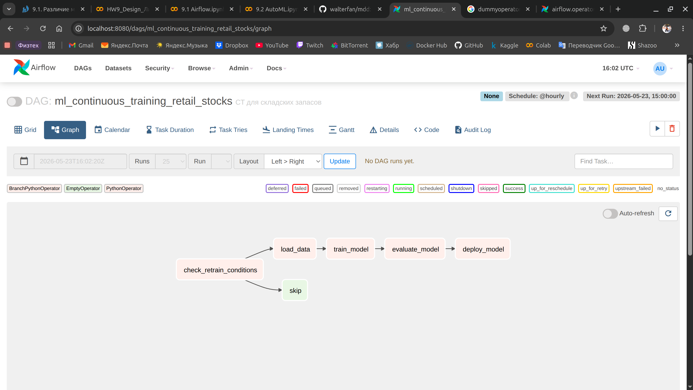

# Домашнее задание 9. Проектирование системы целиком

## 1. Сравнить архитектуры ML-конвейеров / виды обучения

В интернет-магазине "Книжный Мир" модель формирования персональных рекомендаций книг обучается раз в сутки на основе всех прошлых покупок и просмотров пользователей, а затем генерирует предложения типа «С этим товаром покупают» (мгновенные обновления не критичны, пользователи должны получать актуальные, но не сиюминутные советы без избыточных затрат на инфраструктуру).

1.1 Батч-архитектура

1.2 По расписанию (ежедневное переобучение)

1.3 ...

Для финансовой платформы "Защита Онлайн" нужна архитектура, которая позволит в режиме реального времени обнаруживать мошеннические транзакции по кредитным картам. Каждая операция мгновенно анализируется, и при выявлении аномалий система должна заблокировать ее за 1500 миллисекунд (критически важна скорость реакции для предотвращения финансовых потерь, поскольку промедление даже на секунду может привести к ущербу).

2.1 Потоковая (стриминговая) архитектура

2.2 По алерту мониторинга (например, при обнаружении дрифта модели)

2.3 ...

Социальная сеть "Мой Круг" использует персонализированную ленты новостей:базовая часть модели ежедневно обновляет общие интересы пользователя на основе его всей многолетней истории активности пользователя. Однако, чтобы лента оставалась свежей, нужно мгновенно учитывать последние действия, такие как новый лайк или репост, корректируя отображаемый контент (т.е. нужно сочетать глубокое понимание пользователя с быстрой адаптацией к его сиюминутным интересам).

3.1 Гибридная архитектура

3.2 По расписанию (ежедневное переобучение)

3.3 ...

В сервисе такси "Быстрый Путь" ценообразование динамическое: модель постоянно адаптируется к меняющимся условиям: количество свободных машин, спрос пассажиров, пробки. Каждое новое событие используется для инкрементального обновления модели (заказ, появление свободной машины и бизнес всегда доволен - цены всегда задраны до небес).

4.1 Онлайн-обучение (непрерывное обучение)

4.2 По появлению новых данных (при загрузке нового батча в хранилище)

4.3 ...

## 2. Написать DAG Airflow для ML-системы для расчета складских запасов сетевого магазина

Для локальной демонстрации, инфраструктура поднимается в [упрощенном виде](docker-compose.airflow.yaml)

[Псевдо-код реализации DAG пайплайна по заданным условиям](airflow/dags/pipeline.py)

## 3. Применить принципы IaC (Infrastructure as Code) для реализации инфраструктуры ML-системы

Инфраструктура ML-системы описана декларативно с помощью Terraform [main.tf](main.tf)

CI/CD pipeline реализован через [GitHub Actions](ci-cd.yaml):
- выполняется инициализация Terraform
- автоматически создаётся инфраструктура (`terraform apply`)
- выполняется DAG pipeline
- инфраструктура удаляется (`terraform destroy`)

Такой подход соответствует принципам Infrastructure as Code (IaC).

### 4. Обеспечить управление рисками (детекция дрейфа, деградации модели, сбои инфраструктуры)

1. Бизнес-уровень SLI
 - точность модели (accuracy < 0.85)
 - время обновления прогноза (> 1 час)
 - количество обработанных чеков (> 10 млн чеков)

Если точность модели падает ниже 0.85 или резко увеличивается количество отсутствующих товаров на складе, оператор получает уведомление о возможном деградировании модели или изменении потребительского спроса.

2. ML SLI
 - дрифт данных (> 0.3)
 - доля успешных запусков Airflow DAG (< 95%)
 - возраст модели (> 24 часов)

При обнаружении дрифта данных или падении успешности DAG ниже 95% система инициирует уведомление и блокирует автоматический деплой новой модели.

3. Инфраструктура SLI
 - доступность Airflow (< 99%)
 - время ответа БД (> 500 мс)
 - доступность хранилища чеков S3 (< 99%)

Если контейнеры Airflow или S3 становятся недоступны, или ресурсы сервера превышают критические значения, система уведомляет оператора.

При нарушении критических SLO выполняются следующие действия:
 - отправка уведомления оператору
 - остановка автоматического деплоя модели
 - сохранение логов и метрик инцидента
 - переключение на предыдущую стабильную версию модели

### 5. Предложить дальнейшие улучшения по Metrics Driven Development

....
